# CAEX Tracking: módulo de tracking logístico (Android)

App para pilotos de Cargo Expreso: consultan los paquetes que tienen asignados, buscan guías y actualizan su estado de entrega, **incluso sin conexión**.

| Ingreso | Lista | Guía no existe (404) | Detalle |
|---|---|---|---|
| 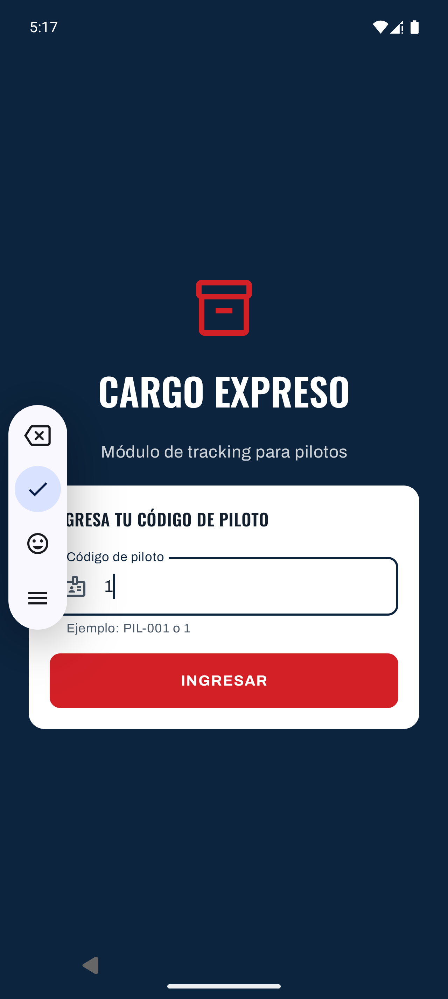 | 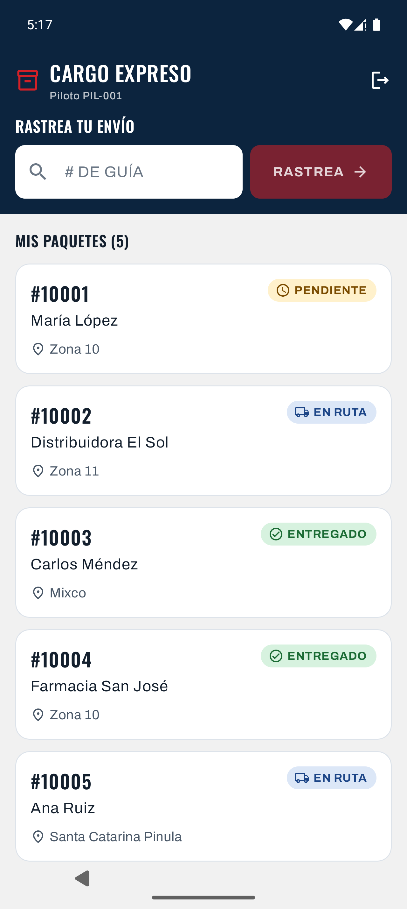 | 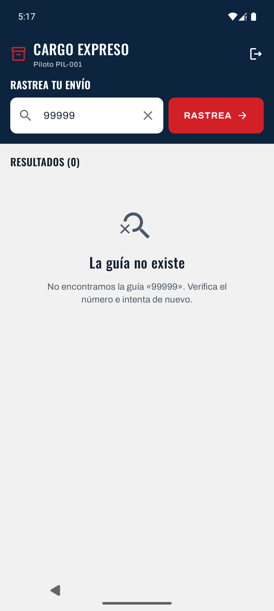 | 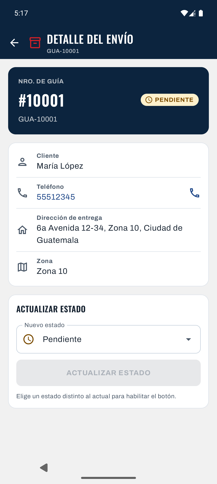 |

| Cambio sin red | Pendiente de sincronizar | Sin red y sin datos | Teléfono pequeño (320dp) |
|---|---|---|---|
| 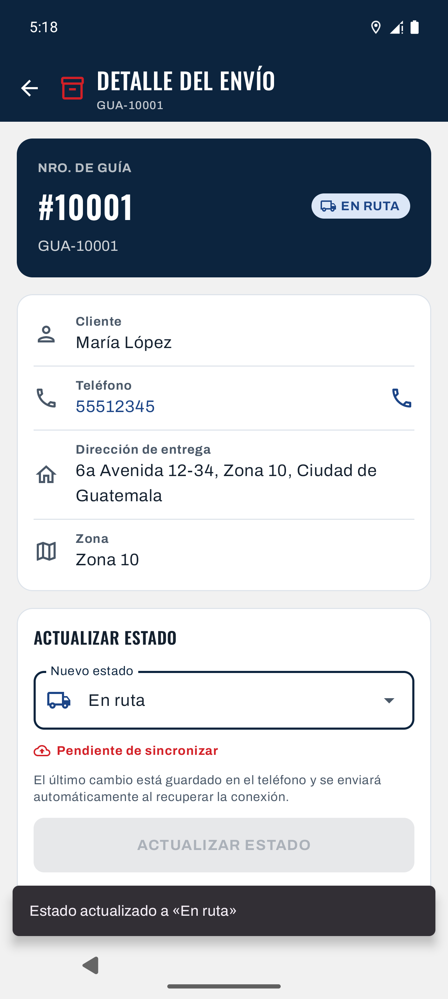 | 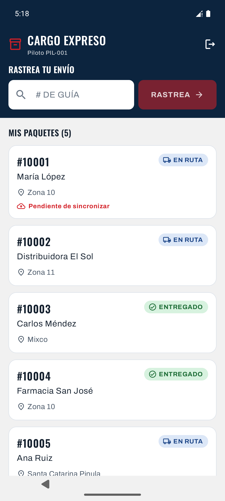 | 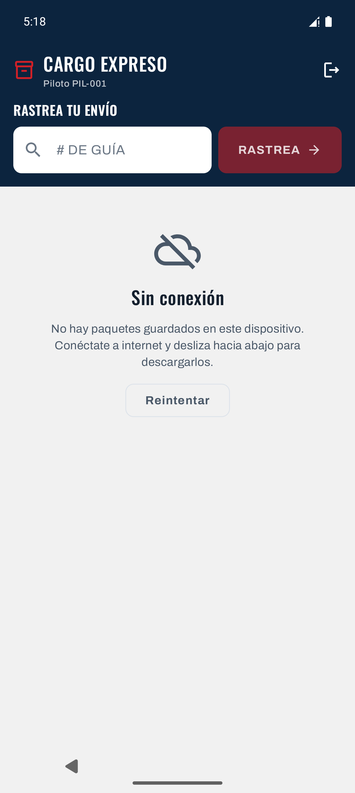 | 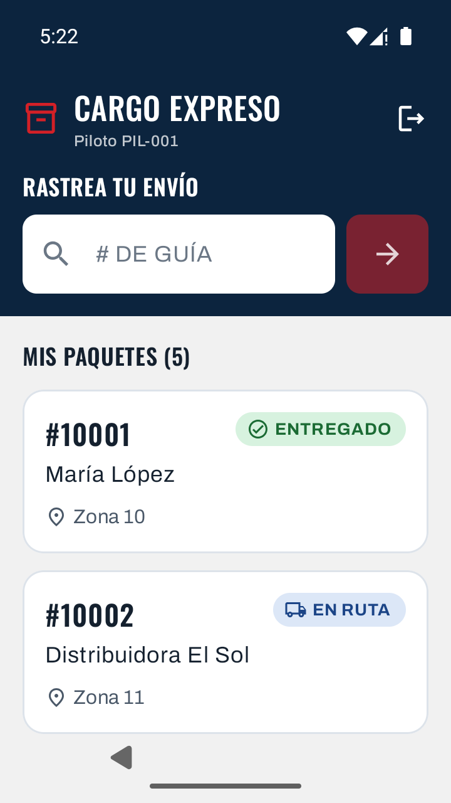 |

| Tablet vertical: lista + detalle | Horizontal, modo oscuro |
|---|---|
| 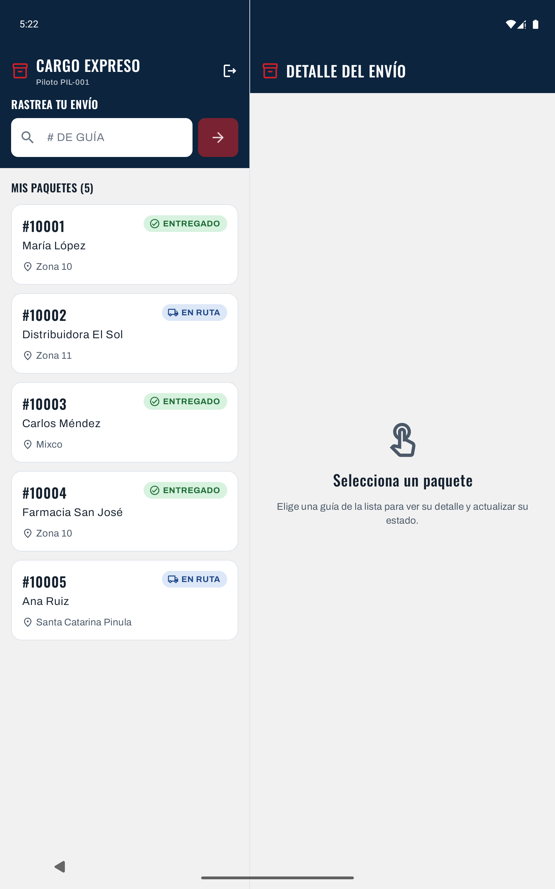 | 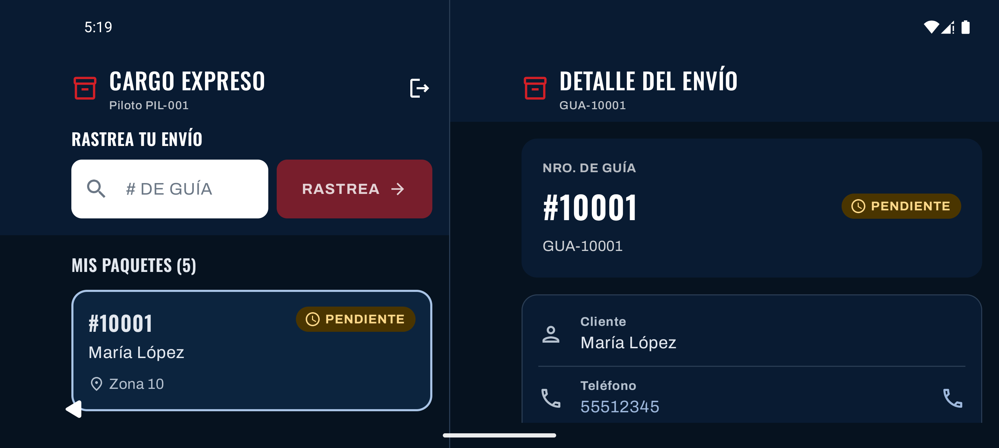 |

---

## Requisitos

| | Versión |
|---|---|
| Android Studio | con soporte para AGP 9.4 |
| JDK | 17 o superior (probado con 21) |
| Android SDK | compileSdk 37 · minSdk 26 (Android 8.0) · targetSdk 37 |
| Gradle | 9.6 (incluido vía wrapper) |

Stack: Kotlin · Jetpack Compose · Material 3 · Hilt · Retrofit + kotlinx.serialization · Room · Navigation Compose · WorkManager · DataStore · SplashScreen API.

## Cómo compilar

```bash
# Tests unitarios
./gradlew testDebugUnitTest

# APK debug (app/build/outputs/apk/debug/app-debug.apk)
./gradlew assembleDebug

# APK release firmado (app/build/outputs/apk/release/app-release.apk)
./gradlew assembleRelease
```

### Firma del release

Las credenciales **no están en el repositorio**. `app/build.gradle.kts` las lee de `keystore.properties`, en la raíz del proyecto (ignorado por git), o de variables de entorno con los mismos nombres, pensado para CI:

```properties
RELEASE_STORE_FILE=release.jks
RELEASE_STORE_PASSWORD=...
RELEASE_KEY_ALIAS=tracking
RELEASE_KEY_PASSWORD=...
```

Si no existen, `assembleRelease` genera un APK sin firmar en lugar de fallar.

## Cómo cambiar `BASE_URL`

La URL del API se define **por build type** como `BuildConfig.BASE_URL` (`app/build.gradle.kts`) y Retrofit la usa con `.baseUrl(BuildConfig.BASE_URL)`. No hay ninguna URL escrita en el código. Debe terminar en `/`.

| Build | Valor por defecto | Cambiarlo sin tocar código |
|---|---|---|
| `debug` | `http://10.0.2.2:8080/` (la PC vista desde el emulador) | `./gradlew assembleDebug -PBASE_URL=http://192.168.1.2:8080/` (celular físico en la misma Wi-Fi) o `-PBASE_URL=https://logisticabackend-production.up.railway.app/` (debug contra producción) |
| `release` | `https://logisticabackend-production.up.railway.app/` (backend en Railway) | `./gradlew assembleRelease -PRELEASE_BASE_URL=https://otro-entorno/` |

Las dos propiedades también se pueden fijar en `gradle.properties` o en `~/.gradle/gradle.properties`.

**HTTP en claro solo en debug.** El backend local usa `http://`, que Android bloquea por defecto. `src/debug/AndroidManifest.xml` apunta a `src/debug/res/xml/network_security_config.xml`, que permite cleartext **únicamente** hacia `10.0.2.2` y `192.168.1.2`. El release no incluye esa configuración, así que solo acepta HTTPS. Si en un celular físico aparece `CLEARTEXT communication to … not permitted`, la IP de la PC cambió: agrégala a ese archivo.

---

## Arquitectura: MVVM + capas + Hilt

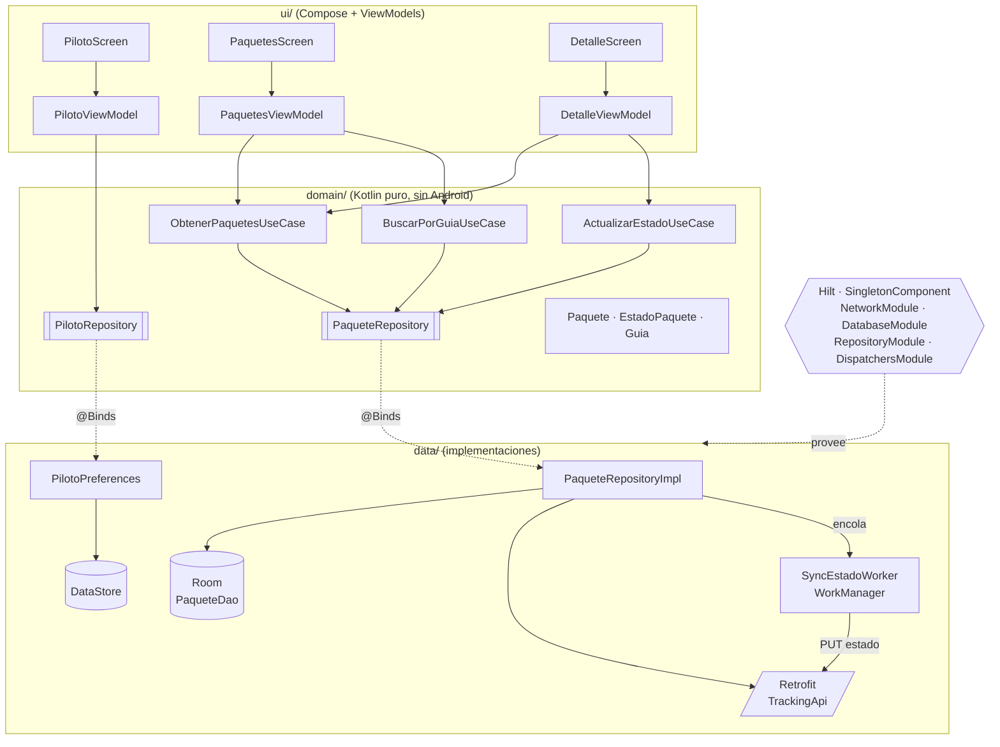

Reglas que respeta el código:

- **`ui/`**: los Composables solo reciben estado y lambdas. Nunca tocan repositorios, Room ni Retrofit. Cada ViewModel (`@HiltViewModel`) expone `StateFlow<UiState>`. Los eventos de una sola vez (snackbar, abrir detalle) van por un `Channel` expuesto como `Flow`, para que una rotación no los repita.
- **`UiState` como `sealed interface`**: `Loading / Success / Empty / Error`, tanto en la lista (`PaquetesUiState`) como en el detalle (`DetalleUiState`).
- **`domain/`**: modelos (`Paquete`, enum `EstadoPaquete`), interfaces de repositorio y casos de uso. No importa nada de Android, por eso se prueba con JUnit puro.
- **`data/`**: `PaqueteRepositoryImpl`, Room, Retrofit y mappers `DTO → Entity → Domain` (`data/mapper/PaqueteMappers.kt`). La UI nunca ve un DTO ni una entidad.

### Inyección de dependencias (Hilt)

| Pieza | Dónde |
|---|---|
| `@HiltAndroidApp` | `TrackingApp` (además implementa `Configuration.Provider` con `HiltWorkerFactory`) |
| `@AndroidEntryPoint` | `MainActivity` |
| `NetworkModule` | `Json`, `OkHttpClient`, `Retrofit`, `TrackingApi` |
| `DatabaseModule` | `AppDatabase`, `PaqueteDao`, `DataStore<Preferences>`, `WorkManager` |
| `RepositoryModule` | `@Binds` de `PaqueteRepository`, `PilotoRepository` y `SyncScheduler` a su implementación |
| `DispatchersModule` | calificador `@IoDispatcher` → `Dispatchers.IO` (sustituible en tests) |
| `@HiltWorker` | `SyncEstadoWorker`, con `@AssistedInject` |

El inicializador automático de WorkManager está desactivado en el `AndroidManifest.xml`, para que WorkManager use la `HiltWorkerFactory` y pueda inyectar el repositorio en el Worker.

### Patrón Singleton

Estas dependencias son **`@Singleton` + `@InstallIn(SingletonComponent::class)`**. Hay una sola instancia por proceso, que vive lo mismo que la `Application`:

| Singleton | Módulo |
|---|---|
| `OkHttpClient` | `NetworkModule` |
| `Retrofit` | `NetworkModule` |
| `TrackingApi` | `NetworkModule` |
| `AppDatabase` (Room) | `DatabaseModule` |
| `PaqueteDao` | `DatabaseModule` |
| `DataStore<Preferences>` | `DatabaseModule` |
| `PaqueteRepository`, `PilotoRepository` | `RepositoryModule` (+ `@Singleton` en la implementación) |

`Room.databaseBuilder` y `Retrofit.Builder` **solo aparecen dentro de los módulos de Hilt**. Ninguna otra clase crea estas instancias: todas las reciben por constructor. Se puede comprobar con:

```bash
grep -rn "databaseBuilder\|Retrofit.Builder\|OkHttpClient.Builder" app/src/main
```

**Por qué deben ser únicas:**

1. **Una sola conexión a SQLite.** Cada `RoomDatabase` abre su propio pool de conexiones al mismo archivo. Con varias instancias hay escrituras concurrentes que terminan en `database is locked`, y además los `Flow` de una instancia no se enteran de lo que escribe otra: la lista no se actualizaría al cambiar un estado desde el detalle.
2. **Reutilizar el pool de OkHttp.** `OkHttpClient` mantiene un pool de conexiones keep-alive, caché y threads del dispatcher. Un cliente por petición repetiría el handshake TCP/TLS cada vez y desperdiciaría memoria y batería, algo que importa en un teléfono de piloto con datos móviles.
3. **Una sola fuente de verdad.** El repositorio es único, así que la lista, el detalle y el Worker de sincronización leen y escriben el mismo Room. DataStore, además, **exige** una única instancia por archivo: dos instancias sobre `preferencias.preferences_pb` lanzan `IllegalStateException`.

---

## Offline-first

```
Abrir app ──► muestra Room al instante ──► GET /api/pilotos/{id}/paquetes ──► actualiza Room ──► la UI se refresca sola (Flow)
                                         └─► GET /api/tracking/{guia} de los que no tienen detalle ──► teléfono y dirección disponibles offline

Actualizar estado ──► UPDATE en Room (syncPendiente = true) ──► UI actualizada al instante
                  └─► encola SyncEstadoWorker (NetworkType.CONNECTED)
                          └─► con red: PUT /api/tracking/{guia}/estado {estado, fechaCambio, observaciones?}
                                  └─► se guarda el estado VIGENTE de la respuesta (last-write-wins)
```

- **Room es la fuente de verdad.** Toda pantalla observa Room. La red solo sirve para refrescarlo.
- `PaqueteEntity.syncPendiente` se muestra como **"Pendiente de sincronizar"** en la tarjeta y en el detalle.
- Un refresco del servidor **no pisa** cambios locales que aún no se han enviado (`PaqueteDao.reemplazarDelPiloto`).
- **Last-write-wins.** `fechaCambio` es el momento real del cambio en el dispositivo (UTC, sufijo `Z`), no el del envío, y la cola se envía en orden cronológico. El PUT siempre responde con el estado **vigente**: la app guarda y muestra ese, no el que envió. Si difiere, un cambio más reciente superó al del piloto. En ese caso el cambio sale de la cola sin reintentarse y el detalle muestra un aviso (*"Tu cambio a «En ruta» no se aplicó…"*).
- Si el piloto vuelve a cambiar el estado mientras un PUT está en vuelo, el primero solo sale de la cola si no hubo otro cambio, comparando `fechaCambio` (`resolverSync`). El cambio nuevo se envía en la siguiente ejecución.
- Si el servidor rechaza `fechaCambio` porque el reloj del dispositivo está más de 5 min adelantado (400 con `errors.fechaCambio`), la app reenvía una vez sin fecha y el servidor usa su propia hora. Así el cambio no se pierde.
- El Worker usa `APPEND_OR_REPLACE` y backoff exponencial. Errores de red y 5xx se reintentan: reenviar el mismo cambio es seguro porque el servidor no lo duplica. Un 400/404 saca el cambio de la cola, avisa al piloto con el `detail` del servidor y restaura el estado real.
- **Sin red y con Room vacío** se muestra un estado vacío explicando que no hay conexión, con botón para reintentar.

## Pantallas

1. **Ingreso de piloto.** Código `PIL-001`, guardado en DataStore. También acepta `1`, `001` o `pil-1`. El splash se mantiene visible mientras se lee DataStore, así no parpadea esta pantalla si ya hay un piloto guardado.
2. **Lista de paquetes.** `LazyColumn` de tarjetas: `#10001` en negrita, cliente, zona y chip de estado.
   - El buscador destacado filtra localmente mientras se escribe. Acepta `10001`, `GUA-10001`, `gua-10001` o `#10001`.
   - **RASTREA** con una sola coincidencia abre el detalle. Sin coincidencia local consulta `GET /api/tracking/{guia}`, y un **404** muestra *"La guía no existe"*.
   - Pull-to-refresh, e indicador de pendiente de sincronizar.
3. **Detalle.** Guía, cliente, teléfono (un toque abre el marcador con `ACTION_DIAL`, sin permiso de llamada), dirección completa, zona y estado actual.
   - `ExposedDropdownMenuBox` con PENDIENTE / EN_RUTA / ENTREGADO / NO_ENTREGADO.
   - **ACTUALIZAR ESTADO** queda deshabilitado mientras el estado elegido sea el actual. Al guardar muestra un snackbar de confirmación.

### Responsivo (WindowSizeClass)

| Ancho | Layout |
|---|---|
| **Compact** (< 600dp, teléfono vertical) | lista → detalle con Navigation Compose (rutas tipadas) |
| **Medium / Expanded** (tablet, teléfono horizontal, plegable) | lista y detalle lado a lado |

La selección sobrevive al rotar: si se abre un paquete en horizontal y se gira a vertical, queda abierto en la pantalla de detalle. En pantallas muy angostas (< 340dp) el botón RASTREA queda solo con ícono.

**Probado en** el emulador Pixel 9 Pro (vertical y horizontal, modo claro y oscuro). También se simuló un teléfono pequeño (720×1280 @ 360dpi, 320dp de ancho) y una tablet (1600×2560 @ 320dpi, 800dp de ancho) cambiando el tamaño de pantalla con `adb shell wm size/density`.

---

## UX/UI basada en cargoexpreso.com

Los tokens se extrajeron del CSS del sitio (`wp-content/themes/caex-v2/css/custom.css`, página `/tracking/`):

| Token | Valor | Uso en el sitio → uso en la app |
|---|---|---|
| Primario | `#0C243E` azul marino | header, botones COTIZA/PORTAL → TopAppBar, banda del buscador, `primary` |
| Acento | `#D32027` rojo (hover `#B71F22`) | botón **RASTREA** → botón RASTREA y ACTUALIZAR ESTADO |
| Secundario | `#1C4587` azul | enlaces → teléfono, `secondary`, chip EN RUTA |
| Fondo | `#F1F1F1` | secciones → `background` |
| Oscuro | `#091B32` | footer → superficies del modo oscuro |
| Tipografía | **Oswald** (titulares) + **Archivo** (texto) | Google Fonts, licencia OFL, incluidas en `res/font` para no depender de red |
| Radios | 10px botones/campo de guía, 15px tarjetas | `shapes.small = 10dp`, `shapes.medium = 15dp` |

- Tema Material 3 propio en `ui/theme/Color.kt`, `Type.kt` y `Theme.kt`, con **dynamic color desactivado** (la marca manda) y paleta clara y oscura del mismo matiz.
- TopAppBar azul marino con el ícono y el nombre de la marca en ambos modos. Los íconos de la barra de estado son siempre blancos.
- Buscador al estilo del sitio: input blanco grande (56dp) y botón rojo **RASTREA →** sobre la banda azul.
- Chips con color semántico **más ícono y texto**, nunca solo color: PENDIENTE ámbar, EN RUTA azul, ENTREGADO verde, NO ENTREGADO rojo.
- Splash (SplashScreen API) e ícono adaptativo (con variante monocroma) en azul marino con una caja y cinta roja.

---

## Decisiones y supuestos

- **Contrato del API** (backend .NET 10 + PostgreSQL). Todo lo que depende de él está en `data/remote/`.

  | Endpoint | Cómo lo usa la app |
  |---|---|
  | `GET api/pilotos/{pilotoId}/paquetes` → `[PaqueteResumen]` \| 404 | `pilotoId` **numérico**: el piloto escribe `PIL-001` y la app llama con `1`. **404** → *"Piloto no encontrado"* con botón para cambiar el código. **200 `[]`** → *"Sin entregas para hoy"* |
  | `GET api/tracking/{guia}` → `PaqueteDetalle` \| 400 \| 404 | búsqueda remota y detalle completo. `telefono` y `observaciones` pueden ser `null` |
  | `PUT api/tracking/{guia}/estado` → `PaqueteDetalle` \| 400 \| 404 | `{"estado", "fechaCambio", "observaciones"?}` (los `null` no se envían) |

  - **Errores ProblemDetails (RFC 7807).** Se lee el `errorBody()` y se muestra su `detail` (p. ej. *"La guía GUA-99999 no existe"*). En un 5xx se muestra *"Error del servidor, intenta de nuevo"*. Nunca se muestra el JSON crudo (`data/remote/ProblemDetails.kt`).
  - **El resumen de la lista no trae teléfono ni dirección.** Tras cada refresco la app descarga en segundo plano el detalle de los paquetes que aún no lo tienen (4 en paralelo) y lo guarda en Room, para tenerlo sin conexión. Al abrir un detalle también se pide la versión más reciente.
  - **Formato de guía `GUA-\d{5}`.** `10001` se normaliza a `GUA-10001` antes de llamar. Lo que no son exactamente 5 dígitos (p. ej. `ABC`) se rechaza en el dispositivo con *"Formato de guía inválido"*, sin llamar al servidor. Si aun así llega un 400, se muestra el `detail` del servidor.
  - **`observaciones`.** Campo opcional en el detalle, rotulado *"Motivo de no entrega"* cuando se elige NO_ENTREGADO, con máximo 500 caracteres. Vacío = no se envía (no modifica lo que hay en el servidor).
  - **Horas.** Los DTO guardan las fechas como `String` ISO-8601 UTC. `ultimaActualizacion` se muestra convertida a hora de Guatemala (UTC-6).
- **Selección de piloto.** Se implementó la pantalla completa con DataStore, en vez del piloto 1 fijo. El ícono de salida en la lista permite cambiar de piloto.
- **Guías buscadas que no son del piloto.** Se guardan en Room sin piloto asignado, para que el detalle (que siempre lee de Room) pueda mostrarlas y actualizarlas offline, sin que aparezcan en "Mis paquetes".
- **Estructura del repositorio.** El proyecto Android está en la raíz, tal como lo generó Android Studio. Para entregarlo en `/android` basta con mover la carpeta completa: no hay rutas absolutas.

## Tests

```bash
./gradlew testDebugUnitTest
```

35 tests unitarios con **repositorios fake inyectados por constructor** (`app/src/test/.../fakes`), sin Android ni mocks:

| Suite | Qué cubre |
|---|---|
| `DetalleViewModelTest` (13) | Loading/Empty/Success, descarga del detalle al abrir, observaciones enviadas u omitidas, la selección vuelve al estado vigente si el servidor impone otro, botón deshabilitado si no cambió el estado, actualización con programación de sync y snackbar, error al guardar, cambio de guía |
| `PaquetesViewModelTest` (10) | Piloto 404 vs lista vacía, filtro por número y por código completo, apertura directa con una sola coincidencia, búsqueda remota con guía normalizada, formato inválido sin llamar al API, 404 → "La guía no existe", estado vacío sin conexión |
| `ProblemDetailsTest` (4) | `detail` del 404, `errors.fechaCambio` del 400, mensaje genérico en 5xx, cuerpo no JSON |
| `GuiaFiltroTest` (8) | Reglas del filtro: vacío, prefijo, mayúsculas y `#`, coincidencia parcial, normalización y validación `GUA-\d{5}` |
